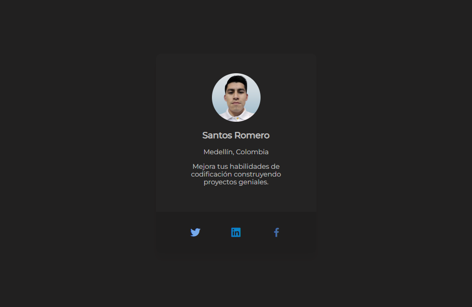

# 🪪 Tarjeta de perfil personal - 100daysofprojects

Tarjeta de perfil personal construido con HTML y CSS, para mejorar nuestras habilidades de codificación.
Este proyecto es parte del desafío de codificación #100DaysOfProjects promovido por [Frontend Club](https://www.facebook.com/frontendclubfb).



<details>
<summary> Tabla de contenidos </summary>

- [Descripcion](#descripcion)
- [Desarrollo](#desarrollo)
- [Lanzamiento](#lanzamiento)
- [Agradecimientos](#agradecimientos)
- [Contacto](#contacto)

</details>

## 📄 Descripcion

Construir una tarjeta de presentación personal, usando HTML y CSS.
Lograr que se parezca lo más posible al diseño proporcionado.

## Desarrollo

### Tecnologias

Para completar el proyecto, se emplearon las siguientes tecnologías:

- [HTML semántico](https://www.w3schools.com/html/)
- [Estilos CSS](https://www.w3schools.com/css/)
- [Normalize CSS](https://necolas.github.io/normalize.css/)
- [Metodología BEM](https://en.bem.info/methodology/quick-start/)
- [Boxicons](https://boxicons.com/)

### Estructura del proyecto

El proyecto se compone de las siguientes carpetas y archivos:

```mmd
/
📂
├── 📂css/
│   ├── normalize.css
│   └── style.css
├── 📂images/
└── index.html
└── README.md
```

## Lanzamiento

[Vercel](https://vercel.com/100daysofprojects) es nuestro proveedor de hosting gratuito para alojar este proyecto.

Puedes registrarte de forma gratuita para alojar tus próximos proyectos.

## Agradecimientos

Agradecemos a Frontend Club por promover el hábito de la práctica diaria a través del desafío de codificación 100daysofprojects.

## Contacto

Puedes enviarme un correo para intercambiar ideas. Estaré feliz de hablar contigo.
